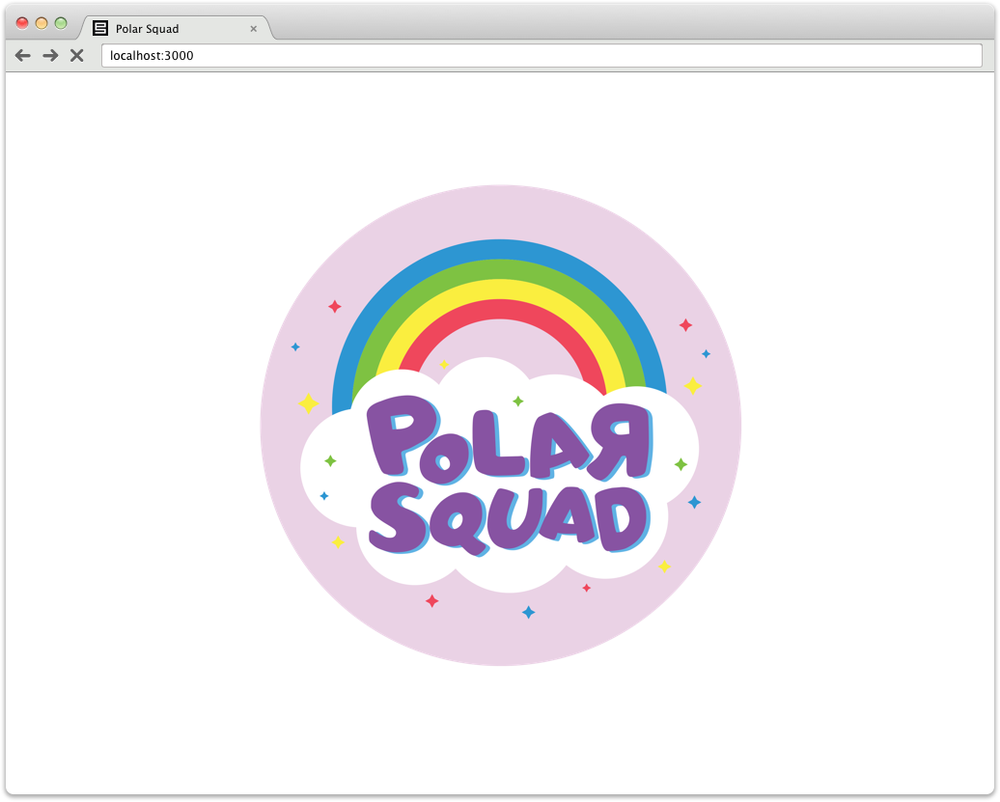

# Hello World App
This is simple web application for testing in Docker, Kubernetes, etc.



### Features
- "Think" - Causes the application to use 100% of CPU for a moment to simulate computation
- "Pump up" - Causes the application to slowly eat a lot of memory to simulate memory leak
- "Suicide" - Causes the application to crash to test recovery

## Development

### Run in Docker
```shell
docker build -t polarsquad:hello-world-app
docker run -it --rm -p 3000:3000 polarsquad:hello-world-app
```
> Open [http://localhost:3000]()

### Run with Docker Compose
```shell
docker-compose up
```
> Open [http://localhost:3000]()

### Run locally
#### Prerequisites
1. Install NodeJS (check version from `.nvmrc`)
2. Install Yarn (`npm install -g yarn`)
3. Install dependencies (`yarn install`)

```shell
yarn start
```
> Open [http://localhost:3000]()
